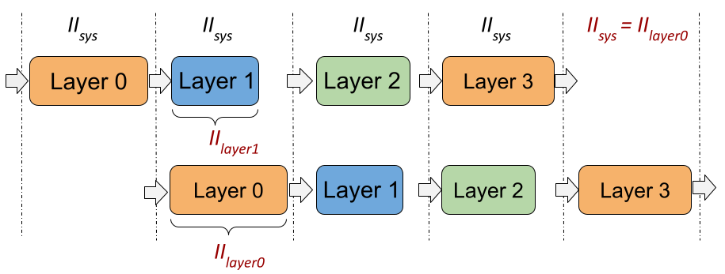
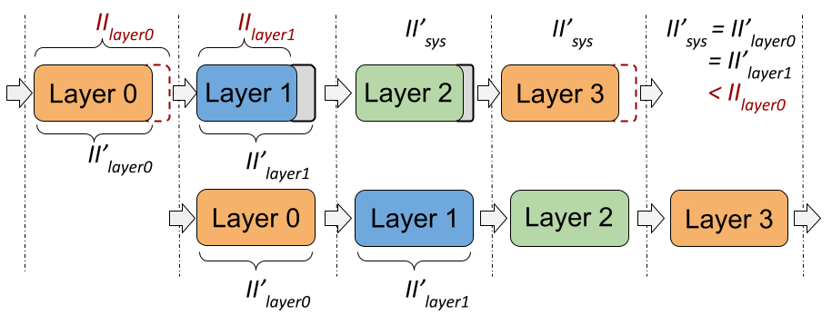

# LSTM-HLS

This repository includes the LSTM template and a few examples in Vivado HLS. These examples are tested using **Vivado HLS 2019.02**. We are still work on more examples which will be released later. If you find any issue, please ping me an email. 

This work proposes II balancing for a coarse-grained pipelined architecture to enable fast multi-layer LSTM inference running on FPGAs. 

## Citation
If you find the LSTM template and these exmaples useful, please cite our paper:

```{=latex}
@inproceedings{que2021accelerating,
  title="{Accelerating Recurrent Neural Networks for Gravitational Wave Experiments}",
  author={Que, Zhiqiang and Wang, Erwei and Marikar, Umar and Moreno, Eric and Ngadiuba, Jennifer and Javed, Hamza and Borzyszkowski, Bartłomiej and Aarrestad, Thea and Loncar, Vladimir and Summers, Sioni and Pierini, Maurizio and Cheung, Peter Y and Luk, Wayne },
  booktitle={32th International Conference on Application-specific Systems, Architectures and Processors (ASAP)},
  year={2021},
  organization={IEEE}
}
```


## Example1: lstm mnist
A MNIST application implemented by HLS-based LSTM

- Model
```python
def mnist_lstm(x):
    inputs = Input(shape=(x.shape[1], x.shape[2]))
    L1 = LSTM(32)(inputs)
    L2 = Dense(10)(L1)
    output = Activation('softmax')(L2)
    model = Model(inputs=inputs, outputs=output)
    return model
```

- How to run

```bat
cd lstm_mnist/prj_cmd
vivado_hls -f build_prj_ku115.tcl
```

- Check the report

The report can be found here: 
prj_cmd/myproject_prj/solution1/syn/report/lstm_csynth.rpt


## Example2: lstm autoencoder targeting anomaly detection

- Model
```python
def autoencoder_lstm(x):
    inputs = Input(shape=(x.shape[1], x.shape[2]))
    L1 = LSTM(9, return_sequences=False)(inputs)
    L2 = RepeatVector(x.shape[1])(L1)
    L3 = LSTM(9, return_sequences=True)(L2)
    output = TimeDistributed(Dense(x.shape[2]))(L3)
    model = Model(inputs=inputs, outputs=output)
    return model
```
- How to run

```bat
cd lstm_ae_small/prj_cmd
vivado_hls -f build_prj_z7045.tcl
```

- Check the report

The report can be found here: 
prj_cmd/myproject_prj/xxxx/syn/report/lstm_csynth.rpt


## Introduction of II balancing
Deep neural networks are very common nowadays. They has many layers. This work maps all the layers on-chip to achieve low latency. The design runs in coarse grained pipelining, like this figure shows. And the final initiation interval (II) will be the largest II among all the layers.

```
II = MAX (II_layer0 , II_layer1  , … , II_layerN)
```




Then, how we can optimize this system with multi-layers? Since the system II equals to the largest II, we can focus on that specific layer which has the largest II. Generally, the II cycles can be reduced if more hardware resources are allocated to that specific layer by adding more parallelisms. So the targeted layer should be allocated as many hardware resources as possible. However, the hardware resources on a given FPGA are limited, which means that the other layers may occupy less hardware resources. When the resources for a layer decrease, the II of that layer will increase. Then this layer may become the one that has the largest II and dominates the design. Thus, we find the optimal case is that all the layers have the same II, in which scenario the design utilizes the hardware resources efficiently and achieves the best initiation interval with a given FPGA device. 



In other words, we can reallocate the hardware resources to balance the II to achieve a better design II. For example, the hardware resources for layer 1 can be reduced because it has a small II. Then, the saved resources can be reallocated to layer 0. so that,  The II of the layer1 is increased to II_layer1 prime while the layer0 II which is the largest can be reduced to II_layer0 prime. We can do the same to the Layer 2 and 3 so that the final design II can be reduced. 

Since all the layers have the same II, in a multi-layer LSTM-based design, we only need to focus on the optimization for a single LSTM layer. I will talk about it more in the next section. 


## Introduction of the LSTM unit
A diagram of an LSTM cell is as shown in the following figure. It consists of three main parts. At the front, there are four LSTM gates which perform matrix-vector multiplications (MVM), followed by activation functions. While in the tail, there are a few element-wise operations. 


This work splits one LSTM layer into two sub-layers. The first one is the mvm_x which has no data dependencies while the second one includes all the others which form a loop with data dependencies, as shown in the following figure. 


After we have split the LSTM layer into two sub-layers, the two can be pipelined with balanced initiation interval (II) as shown in this figure. As we dicussed in the last section, the optimal case is that the latency numbers of two blocks are the same. 


