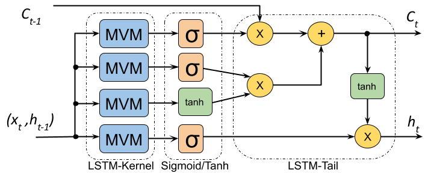
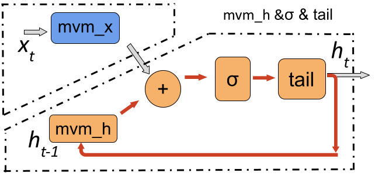

# LSTM-HLS


## lstm-mnist
A MNIST application implemented by HLS-based LSTM

- Model
```python
def mnist_lstm(x):
    inputs = Input(shape=(x.shape[1], x.shape[2]))
    L1 = LSTM(32)(inputs)
    L2 = Dense(10)(L1)
    output = Activation('softmax')(L2)
    model = Model(inputs=inputs, outputs=output)
    return model
```

- How to run

```bat
cd lstm-mnist
vivado_hls -f build_prj.tcl
```

- Check the report

The reports are in the following directory: 
lstm_mnist/myproject_prj/solution1/syn/report

## Introduction of our LSTM unit
A diagram of an LSTM cell is as shown in the following figure. It consists of three main parts. At the front, there are four LSTM gates which perform matrix-vector multiplications (MVM), followed by activation functions. While in the tail, there are a few element-wise operations. 





This work splits one LSTM layer into two sub-layers. The first one is the mvm_x which has no data dependencies while the second one includes all the others which form a loop with data dependencies, as shown in the following figure. 




After we have split the LSTM layer into two sub-layers, the two can be pipelined with balanced initiation interval (II) as shown in this figure. 


