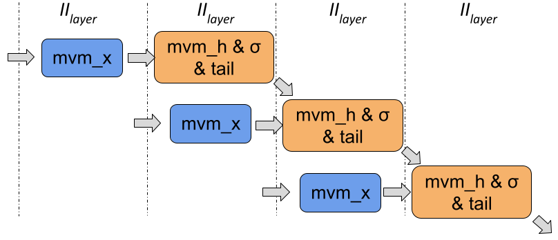

# LSTM-HLS

This repository includes the LSTM template and one mnist example in Vivado HLS. We are still work on more examples which will be release later. If you find any issue, please ping me an email. 

## lstm-mnist
A MNIST application implemented by HLS-based LSTM

- Model
```python
def mnist_lstm(x):
    inputs = Input(shape=(x.shape[1], x.shape[2]))
    L1 = LSTM(32)(inputs)
    L2 = Dense(10)(L1)
    output = Activation('softmax')(L2)
    model = Model(inputs=inputs, outputs=output)
    return model
```

- How to run

Only be tested using Vivado HLS 2019.02

```bat
cd lstm-mnist/prj_cmd
vivado_hls -f build_prj_ku115.tcl
```

- Check the report

The reports are in the following directory: 
lstm_mnist/myproject_prj/solution1/syn/report

## Citation
If you find the LSTM template and mnist exmaple useful, please cite our paper:

```{=latex}
@inproceedings{que2019efficient,
  title="{Accelerating Recurrent Neural Networks for Gravitational Wave Experiments}",
  author={Que, Zhiqiang and Wang, Erwei and Marikar, Umar and Moreno, Eric and Ngadiuba, Jennifer and Javed, Hamza and Borzyszkowski, Bartłomiej and Aarrestad, Thea and Loncar, Vladimir and Summers, Sioni and Pierini, Maurizio and Cheung, Peter Y and Luk, Wayne },
  booktitle={32th International Conference on Application-specific Systems, Architectures and Processors (ASAP)},
  year={2021},
  organization={IEEE}
}
```

## Introduction of our LSTM unit
A diagram of an LSTM cell is as shown in the following figure. It consists of three main parts. At the front, there are four LSTM gates which perform matrix-vector multiplications (MVM), followed by activation functions. While in the tail, there are a few element-wise operations. 


This work splits one LSTM layer into two sub-layers. The first one is the mvm_x which has no data dependencies while the second one includes all the others which form a loop with data dependencies, as shown in the following figure. 


After we have split the LSTM layer into two sub-layers, the two can be pipelined with balanced initiation interval (II) as shown in this figure. 



